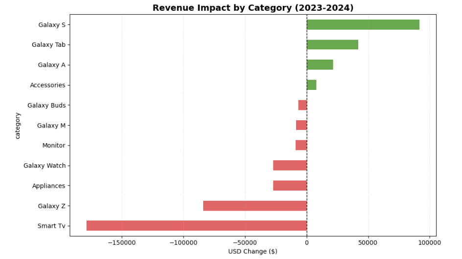
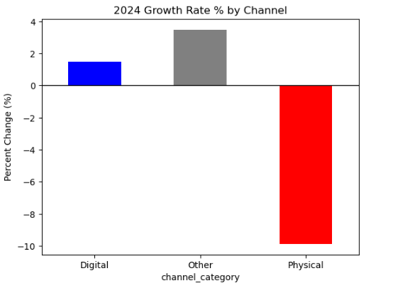
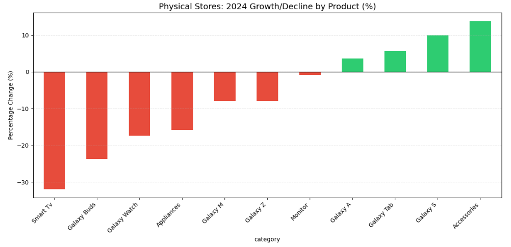
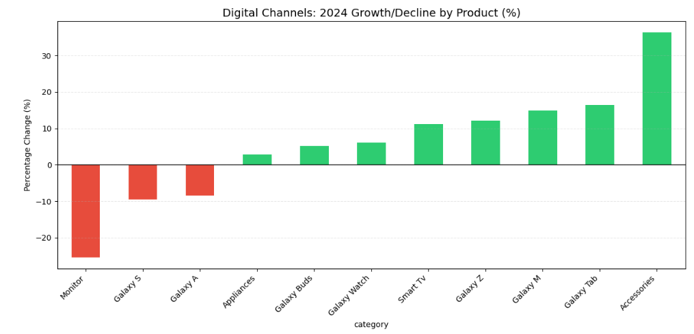

# Samsung Global Product Sales Analysis (2021 – 2024) 📱📊
This dataset found on Kaggle **https://www.kaggle.com/datasets/ashyou09/samsung-global-product-sales-dataset** simulates a realistic global sales records for Samsung Electronics products presenting **5,500 synthetic transactions** across **52 countries and 555+ cities**.

## 🎯 Business Objective 
This analysis tracks sales performance across product categories and distribution channels between 2021 and 2024. The primary objective was to explore the shifting of the revenue, categorize sales into groups (digital, physical), and pinpoint specific underperforming categories within physical retail spaces to guide future business choices.

---
## 🛠️ Tech Stack & Python Libraries
* **Language:** Python
* **Libraries Used:** 
  * `pandas` & `numpy` 
  * `matplotlib` & `seaborn`
---

## ⚙️ Data Engineering & Cleaning Process
I started by thoroughly cleaning the raw dataset to ensure both the text categories and numerical values were completely accurate and consistent:

* **Handling Missing Data:** Replaced missing text with "Unknown" and filled empty customer ratings with the average score.
* **Standardizing Text:** Used `.str.strip()` to remove accidental spaces and `.str.title()` to fix messy capitalization in the location and product columns.
* **Formatting Money:** Rounded revenue numbers to two decimal places so the financial data looks clean and consistent.
  
## 📈 Key Insights & Visualizations

### 1. Global Revenue Drop Driven by Smart TV Sales (2023 vs. 2024)
* **The Discovery:** Global revenue experienced a sharp decline of **$176,619.09** in 2024 compared to 2023. 
* **The Root Cause:** By isolating the year-over-year revenue impact, I discovered that **Smart TVs** were almost entirely responsible for the shortfall, suffering a massive individual loss of **$178,551.48**. 



### 2. Channel Deep-Dive: 
* **The Discovery:** To uncover *where* the Smart TV crash occurred, I segmented 2023 vs. 2024 revenue specifically for Smart TVs across **Digital vs. Physical** sales channels.
* **The Root Cause:** The data revealed that **Physical Stores** suffered a drop of **$257,054.43** in Smart TV sales. 



### 3. Physical stores Deep Dive: 
* **What I did:** Once I knew physical stores were having trouble, I filtered for the "Physical" channel only to every single product.
* **The discovery:** * **Smart TVs** had the worst drop (down over 30%).
  * Wearables are also struggling in stores (**Galaxy Buds** dropped over 20%, **Galaxy Watches** dropped nearly 18%).
  * On the bright side, **Galaxy S** phones and **Accessories** are doing great and actually growing in physical stores.



### 4. Digital Channels Deep Dive:
* **What I did:** I filtered for the "Digital" channel only and calculated the YoY percentage growth/decline for all product categories.
* **The discovery:** Online demand for **Smart TVs** did not crash. Furthermore, top-tier **Galaxy S** phones and **Accessories** showed strong upward trends online, showing that the company online business isn't the problem



### 5. Isolating the problem by product and location
* **What I did:** To find the exact problem, I filtered for physical Smart TV sales and broke them down by `region`. This revealed that the revenue crash was heavily concentrated in **Europe and Asia**. I then grouped the data by individual `product_name` within those regions to find the specific product responsible.
* **The discovery:** I successfully isolated the exact product driving the entire global decline: the **Samsung Neo QLED 8K QN900C**. 

### 6. Investigating the QN900C Sales Numbers
* **What I did:** I isolated the **QN900C** model inside physical stores across Europe and Asia. I used an aggregation function (`.agg()`) to track its average retail price (`unit_price_usd`), actual transaction price (`discounted_price_usd`), and total volume (`units_sold`) year-over-year.
* **The discovery:** In 2023, physical stores sold 65 units of this model. By 2024, sales dropped to just 8 units, despite a stable price of around $5,000. This single product decline is responsible for the entire global revenue drop.

## 🖥️ Interactive Dashboard

* **What I did:** I used **Streamlit** to build a simple sales dashboard (`app.py`).


**Main Features:**
* **Key Numbers:** Shows the exact drop in money and units lost for the TV model.
* **Side-by-Side Charts:** Compares online sales next to physical store sales.
* **Analyst Summary:** Includes a quick notes box explaining the missing stock problem.

*How to run the dashboard locally:*
```bash
streamlit run app.py
```
---
## Conclusion & Recommendations

I used Python to clean this dataset and figure out exactly why Samsung's revenue dropped. By Slicing the data by simplified **Online** vs. **Physical Store** channels instantly revealed that the decline was driven entirely by physical locations, while online sales stayed steady.

Looking closer at the store data, the biggest drop happened in premium TV sales—specifically the **Neo QLED 8K**, which lost over $264,000 in retail revenue compared to last year.

### My Recommendations to Fix the drop:
* **Check Underperforming Stores:** Investigate the specific regions that dropped the most to see if they faced local shipping delays or staffing shortages.
* **Bring online shoppers to the stores:** Try a "buy online, pick up in-store" option to get people walking through the physical doors.
* **Run local sales:** Put up special discounts or promotions only in the cities where sales dropped.

### What I Learned:
Real-world data is messy. This project showed me that cleaning data and grouping it into simple categories is the best way to find and solve a real business problem.

## 🛠️ Tools
* **Python**
* **Jupyter Notebook**
---

## License
This project is licensed under the MIT License – see the [LICENSE](LICENSE) file for details.
